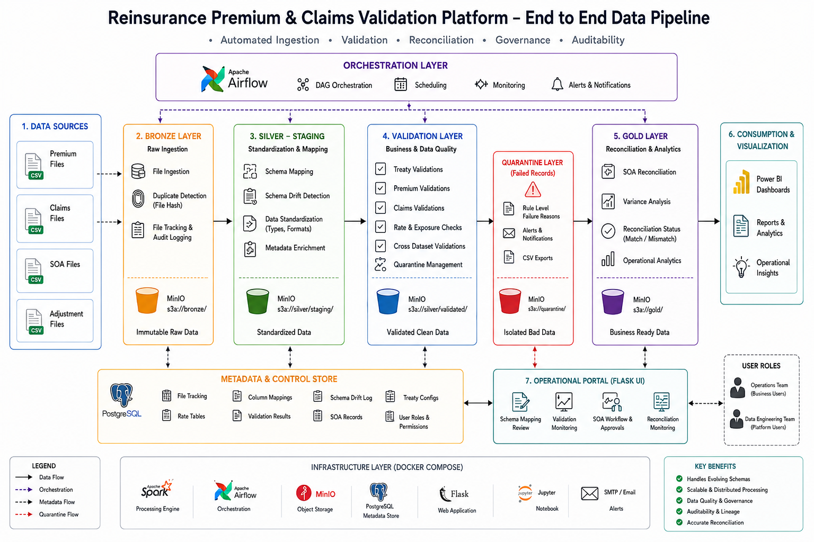

# Reinsurance Premium & Claims Validation Platform



Documentation

For a deeper understanding of the platform, refer to the following documents:

📖 Business Problem & Solution

Explains the reinsurance operational challenges the platform was designed to solve.
Describes the roles of Operations and Data Engineering teams.
Covers treaty validation, claims validation, historical adjustments, and SOA reconciliation.

👉 View Document

🏗️ Technical Architecture

Detailed explanation of the platform architecture and design decisions.
Covers why Spark, Delta Lake, Airflow, PostgreSQL, and MinIO were selected.
Explains metadata-driven processing, schema governance, and validation frameworks.

👉 View Document

📊 Architecture Diagram

High-level view of platform components and data flow.

👉 View Diagram
## Overview

The Reinsurance Premium & Claims Validation Platform is an end-to-end data engineering solution designed to automate the ingestion, standardization, validation, and reconciliation of reinsurance premium and claims data.

The platform addresses common operational challenges faced by Life & Health reinsurance organizations, including poor data quality, evolving reporting schemas, historical adjustments, treaty compliance validation, and Statement of Account (SOA) reconciliation.

Built using Apache Spark, Apache Airflow, Delta Lake, PostgreSQL, MinIO, Flask, and Docker, the platform provides a scalable and metadata-driven framework capable of processing large reinsurance datasets while maintaining auditability, governance, and financial controls.

---

## Business Problem

Life & Health reinsurance treaties often remain active for decades.

During the lifetime of a treaty:

* Source systems change
* Reporting formats evolve
* New fields are introduced
* Historical documentation becomes incomplete
* Data quality issues accumulate
* Historical adjustments are submitted

As a result, the same client may report data using multiple schemas over the life of a treaty while still expecting consistent operational and financial processing.

Historically, much of this work is performed manually using spreadsheets, emails, and institutional knowledge.

As reporting volumes grow, this approach becomes:

* Difficult to scale
* Error-prone
* Difficult to audit
* Difficult to govern

This platform was created to automate and standardize that process.

---

## Architecture

The platform follows a metadata-driven Medallion Architecture.

```text
Premium Files
Claims Files
SOA Statements
      ↓
Bronze Ingestion
      ↓
Silver Staging
      ↓
Schema Drift Detection
      ↓
Premium & Claims Validation
      ↓
Silver Validated
      ↓
SOA Reconciliation
      ↓
Gold Layer
      ↓
Operational Dashboards
```

The architecture separates business data from operational metadata and allows validation logic, mappings, and treaty configurations to evolve independently from processing code.

---

## Core Features

### Data Ingestion

* Automated file ingestion
* Duplicate file detection
* File hash tracking
* Audit logging
* Incremental processing

### Schema Governance

* Metadata-driven column mappings
* Schema drift detection
* Mapping review workflow
* Human-in-the-loop approvals

### Premium Validation

* Treaty mapping validation
* Rate validation
* Exposure validation
* RISAR calculations
* Duplicate detection

### Claims Validation

* Coverage validation
* Duplicate claim detection
* Premium-to-claim matching
* CAL checks
* Chronological validation

### Quarantine Framework

* Failed row isolation
* Rule-level failure attribution
* CSV export of rejected records
* Threshold-based file rejection

### SOA Reconciliation

* Premium reconciliation
* Claims reconciliation
* Variance analysis
* Financial controls
* Audit trail generation

### Operational Control Plane

* Schema review dashboard
* Validation monitoring
* SOA workflow management
* Reconciliation monitoring

---

## Technology Stack

| Layer                  | Technology     |
| ---------------------- | -------------- |
| Workflow Orchestration | Apache Airflow |
| Distributed Processing | Apache Spark   |
| Storage Format         | Delta Lake     |
| Object Storage         | MinIO          |
| Metadata Store         | PostgreSQL     |
| Operational UI         | Flask          |
| Infrastructure         | Docker         |

---

## Why This Architecture?

### Why Spark?

Reinsurance processing involves:

* Historical adjustments
* Cross-period validation
* Claims-to-premium matching
* Treaty exposure calculations
* Large aggregations and joins

Apache Spark provides distributed processing capabilities that allow these operations to scale beyond traditional spreadsheet-based workflows.

### Why Delta Lake?

Reinsurance data frequently requires corrections and adjustments.

Delta Lake provides:

* ACID transactions
* Merge operations
* Schema evolution
* Auditability

which are essential for processing historical adjustments safely.

### Why Object Storage?

Premium and claims datasets are:

* Large
* Historical
* Frequently reprocessed

Object storage provides scalable and cost-effective storage while supporting distributed processing workloads.

### Why Metadata-Driven Processing?

Every client reports differently.

Mappings, treaty configurations, rate tables, and validation rules are stored in metadata tables rather than embedded directly into code.

This allows the platform to adapt to evolving reporting requirements without requiring major code changes.

---

## Repository Structure

```text
.
├── dags/
│   ├── bronze_ingestion_pipeline.py
│   ├── data_ingestion_pipeline.py
│   ├── silver_staging_dag.py
│   ├── silver_validation_dag.py
│   ├── recon_dag.py
│   ├── reminder_dag.py
│   └── SOA_Notification_DAG.py
│
├── dags/scripts/
│   ├── bronze_ingest.py
│   ├── silver_staging.py
│   ├── silver_validation.py
│   └── recon.py
│
├── mapping_ui/
│   └── app.py
│
├── seed_data/
│
├── docs/
│   ├── business-problem.md
│   ├── technical-architecture.md
│   └── images/
│
├── docker-compose.yaml
├── Dockerfile.airflow
├── Dockerfile.flask
├── init.sql
└── requirements.txt
```

---

## Local Setup

### Clone Repository

```bash
git clone https://github.com/<username>/reinsurance-premium-claims-validation-platform.git

cd reinsurance-premium-claims-validation-platform
```

### Configure Environment

Create a local `.env` file using `.env.example.txt`.

### Start Platform

```bash
docker compose up --build
```

### Access Services

| Service       | URL                   |
| ------------- | --------------------- |
| Airflow       | http://localhost:8080 |
| Flask UI      | http://localhost:5000 |
| MinIO Console | http://localhost:9001 |

---

## Engineering Patterns Demonstrated

* Medallion Architecture
* Metadata-Driven Processing
* Delta Lake ACID Storage
* Schema Evolution Management
* Human-In-The-Loop Workflows
* Data Quality Frameworks
* Quarantine Processing
* Distributed Computing
* Operational Control Plane Design
* Reconciliation & Financial Controls

---

## Future Enhancements

* Power BI Reporting Layer
* Great Expectations Integration
* OpenMetadata / Data Lineage
* CI/CD Pipelines
* Cloud Deployment (AWS/Azure)
* Real-Time Streaming Ingestion
* LLM-Assisted Validation Insights

---

## Author

**Harshith Jain**

Technical Account Analyst – Life & Health Reinsurance | Data Engineering | Apache Spark | Airflow | Delta Lake | Reinsurance Data Management
